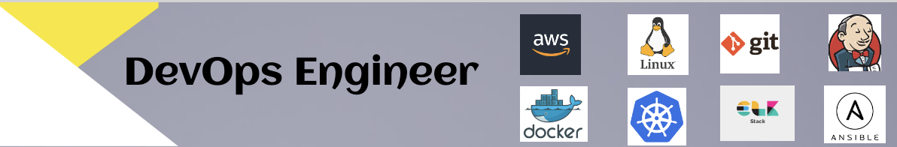

<!--
**sanjanathamke/sanjanathamke** is a ✨ _special_ ✨ repository because its `README.md` (this file) appears on your GitHub profile.

Here are some ideas to get you started:

- 🔭 I’m currently working on ...
- 🌱 I’m currently learning ...
- 👯 I’m looking to collaborate on ...
- 🤔 I’m looking for help with ...
- 💬 Ask me about ...
- 📫 How to reach me: ...
- 😄 Pronouns: ...
- ⚡ Fun fact: ...
-->

<h1 align="center">Hello , I am Sanjana Thamke💻</h1> 
<h3 align="center"> DevOps Engineer | Docker | Linux | Jenkins | AWS | Git | Kubernetes | Technical Blogger |</h3>

- 🔭 I’m currently **Learning Devops Tools**
- 📝 I publish articles on **Various DevOps Concepts**
- 👯 I’m looking to collaborate on **DevOPs community**
- ⚡ My belief **"Every action you take is a vote for the person you wish to become."**
- 📫 How to reach me **https://www.linkedin.com/in/sanjana-thamke-68827417b**

### Blogs posts
<!-- BLOG-POST-LIST:START -->
- [Jenkins CI/CD complete project](https://medium.com/@sanjuthamke9699/day-24-task-complete-jenkins-ci-cd-project-158c10fdf55d------2)
- [Deploying Application with kubernetes using ingress and ngrok for test on browser ](https://medium.com/@sanjuthamke9699/kubernetes-project-c1faded2499f------2)
- [Docker-Compose Project](https://medium.com/@sanjuthamke9699/day-18-task-docker-compose-project-for-devops-engineers-af5d4c6c48c5------2)
- [Kubernetes Architecture](https://medium.com/@sanjuthamke9699/day-30-task-kubernetes-architecture-a4760753a373------2)
- [Docker Command Cheatsheet](https://medium.com/@sanjuthamke9699/docker-command-cheatsheet-b48a3574fc09------2)
- [LINUX & Git-GitHub CHEAT SHEET](https://medium.com/@sanjuthamke9699/linux-git-github-cheat-sheet-b88fd36791d9------2)

<!-- BLOG-POST-LIST:END -->

<h3 align="left">Connect with me:</h3>

